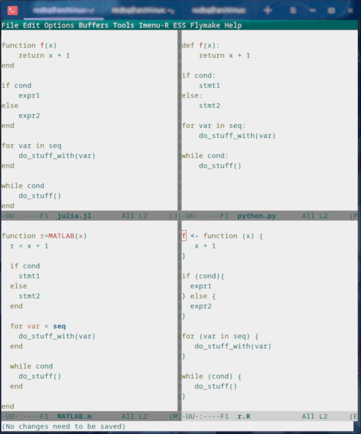
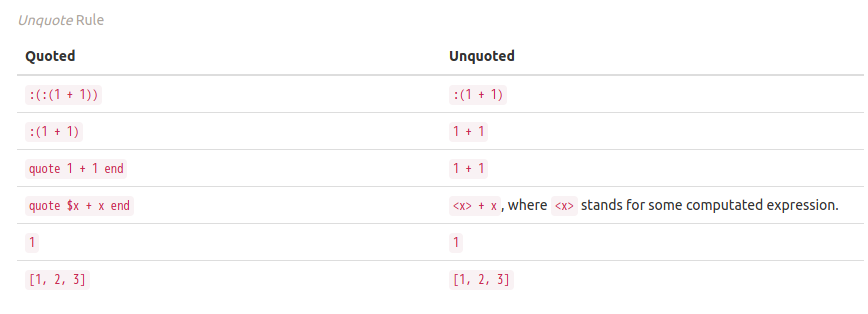
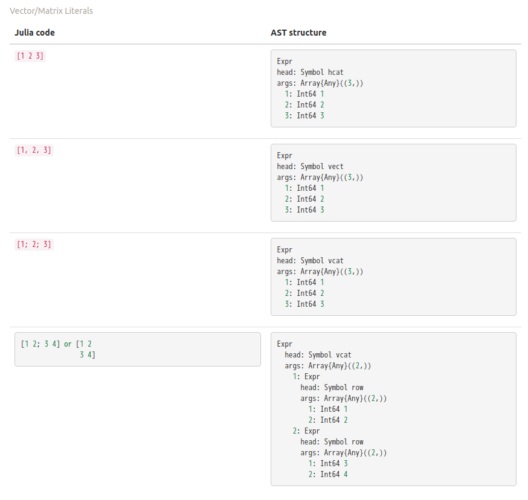

# 高观点下的Julia范用编程

[Julia](https://julialang.org)是一个支持可选类型标注的纯动态多范式语言。

由于其引入的一些像For循环，While循环, If循环, 函数等的基本语言构造, 与Python, R或是MATLAB类似,
Julia变得简单和简洁, 使得你可以仅用它一部分的语言特性便流畅地工作。



尽管人们很少关注Julia除开高性能以外的语言特性(截止2019年4月)，我的角度却是在它的范用编程方面。

## First-Class

Julia中, 几乎所有的语言构造都是**first-class**的，使得语言的灵活性和可组合性得以彰显。

很多人对于Python缺少多行lambda这事抱有偏见。尽管把多行lambda编译到通常的Python code object是相当平凡和直接的,
前端，更具体点，强制缩进，通过严格分离表达式和语句(语句无法出现在表达式中), 限制了Python的表达力, 也失去了
first-class。其他的没有限制expression-first的语言缩进方式是有的，例如ML家族和Haskell, 但还没有被Python社区所采纳。

Julia看起来有点过于first-class, 因为它所有的构造都是表达式, 在语法上讲并不限制任意语言构造的组合。**定义**和**计算**在很多主流的函数式语言中是分离的，只是两者的组成里各自包含对方。

```julia
[let y=f(x); (x, y) end for x in points]
map(
    function map_fn(x)
        # 做一些事情
    end,
    points
)

let bind_maybe(a, f) -> a == nothing ? f(a) : nothing,
    (|>) = bind_maybe

    init          |> a ->
    do1_stuffs(a) |> a ->
    ...           |> a ->
    ...           |> a ->
    ...
end
```


为什么可组合性很关键的原因多年来被经常讨论，所以我不会就此再整一个。
对于Julia而言，first-class在涉及**代码及数据**时会很有用, 文章稍后展开这点。

##　多重分派的多态

Julia支持多态，以实现必要的抽象，减少self-repeating，尽管和那些流行的工业语言有着明显的不同。

多重分派看起来有点像参数化多态, 但实际上其含义比起后者要多。

```julia
   function usum(x :: Vector{T}) where T
      s = zero(T)
      for each in x
         s += each
      end
      s
   end
```

重载也是可以的。

```julia
   uzero(_ :: Type{Int})     = 0
   uzero(  :: Type{Float64}) = 0.0
```

然而多重分派不仅仅是我上面列举的。实际上类型只是可分派的不可变数据的一种特殊实例，
你能够用不可变的数据来分派，不管它是类型还是别的什么劳什子。

```julia

   struct Const{T}
   end

   flip(::Type{Const{:even}}) = Const{:odd}
   flip(::Type{Const{:odd}})  = Const{:even}

   f(::Type{Const{0}}) = Const{:even}
   f(::Type{Const{1}}) = Const{:odd}
   f(::Type{Const{N}}) where N = f(Const{N-1}) |> flip

```

使用上述代码，我们可以如期地静态计算数字的奇偶性。

```julia
   julia> @code_warntype f(Const{2})

   Body::Type{Const{:even}}
     1 ─     return Const{:even}
```

注意，如果多重分派在静态推断上失败，它将表现得如同Python中的动态分派一般。

## Full-Featured的宏

宏是实现代码复用的极少途径之一, 也是为什么有一些程序员千百倍高效于其他人的原因。

```julia

  julia> macro gen_var(n :: Int, f)
         defs = [Expr(:(=), Symbol("var", i), :($f($i)))  for i in 1:n]
         esc(Expr(:block,  defs..., nothing))
       end

  @gen_var (macro with 1 method)

  julia> f(x) = x * 10 - 2
  f (generic function with 1 method)

  julia> @gen_var f (x * 10 - 2)

  julia> var1
  8

  julia> var2
  18
```

## 宏，从AST到AST的函数

一旦你知道宏是从AST到AST的函数后，Julia的宏便不再神秘。

```julia
   macro f(x)
     println(x)
     :($x + 1)
   end

   @assert (@f 1) == 2
```

上述代码展示了Julia宏的一个生动例子。首先 `macro` 关键字引导宏变换规则的定义，而`@f`标记来对应宏规则的调用点。

你可能会问为什么`(@f 1 == 2`, 因为宏`@f`的返回值是一个AST，看起来让它和整数`2`相等有点魔幻。

认真看`@assert (@f 1) == 2`。由于宏调用是从内到外依次处理的，我们首先处理的应该是`@f 1`。

```julia
  (function f(x)
      println(x)
     :($x + 1)         =>  :(1 + 1)
  end)(1)
```

上面这步，在执行AST到AST的函数`f`, 即宏`@f`, 的时候，还会写stdio.

随后，由于我们已经拿到一个输出, AST `:(1 + 1)`, 设想我们用它置换先前代码中的`@f 1`，这会产生一个`@assert $(:(1 + 1)) == 2`,
化简它，然后我们得到`@assert (1 + 1) == 2`。

你可能会问为什么`@assert :(1 + 1) == 2`, 好问题，我们深入研究一个。

想想如果你从宏调用处返回的是一个运行时AST，它不会被转换为要编译的代码，以至于这样的宏会变得完全没有用。

如果我们*unquote*宏的返回，



上面的表格揭示了AST插值的规则，以及，很明显这里有点东西:
如果我们说一个表达式被quote了N次，那么它的插值，作为一个表达式被quote了`max(0, N - 1)`次。


## 作用域和卫生

只要你站在宏是AST到AST的函数这个观点下， 宏(返回的AST)的作用域规则会很简单。

```julia
julia> module A
    var = 0
    macro ma()
      quote
        var
      end
    end
  end

  julia> var = 5555

  julia> A.@ma
  0

  julia> using .A: @ma

  julia> @ma
  0
```

我这儿要说的第一点是, 宏返回的表达式是在宏定义处的模块被求值的。

```julia
  macro assign_y(x)
     :(y = $x)
  end

  function f(x)
    @assign_y x
    y
  end

  f(1)
```

你可能期望这代码能预期跑通，但很不幸，不行，只会给你扔一个

```julia
  ERROR: UndefVarError: x not defined
  Stacktrace:
  [1] f(::Int64) at ./REPL[6]:2
  [2] top-level scope at none:0
```

这里的原因是，AST插值会被预先处理，以确保所有的裸符号(没有包在`QuoteNode`和更深的quote中)会被
转换到像`##a#168`这样有点奇怪的**mangled**符号(也被称为*gensym*). 同时，Julia干这事儿的原因，
是为了默认避免为局部作用域产生新的可见符号。

想想你想打算在计算了值后进行打印的宏:

```julia

   macro with_logging(expr)
      quote
        a = $expr
        @info :logging a
        a
      end
   end

```

我们没把符号`a`转换到类似`##a#167`这样子，假如你已经在你的代码里定义了`a`呢?

```julia
  function x5(a) # 把它当作乘5
      x2 = @with_logging 2a
      x3 = @with_logging 3a
      x2 + x3
  end

  my_func(1)
```

你可以看见如果宏`with_logging`不转换宏定义体里写的`a`, 你将会得到`x5(1) == 8`而不是`x5(1) == 5`。

就是这样，我们叫这样的宏，**卫生宏**。

但是还有一些上下文有关的代码生成，你想要在多个代码生成函数中共享作用域。一个有点东西的例子是
我的MLStyle, 它实现来我自学习编程以来的一个梦想，即能够使用一个高性能且可扩展(可自定义)的模式匹配。
在这个包里，在编译模式的时候，我会使用手动的gensym而不是依靠卫生宏，因为我可能在不同的会生成代码的函数里
访问某些指定的符号。

在这种情况下，人们想要产生可以污染作用域的符号，Julia提供来一种转义(escaped)机制来避免gensym.

```julia
  macro assign_y(x)
     esc(:(y = $x))
  end

  function f(x)
    @assign_y x
    y
  end

  f(1) # 1
```

先前的代码, 在返回的AST上补充了一个`esc`的调用后，便可以正常工作。

##　其他对Julia宏有用的知识点

1. `@__MODULE__`会给当前模块。
2. 当你想要控制求值(evaluate) AST的模块时，你可以用`moduleX.eval(expr)` 或者 `@eval moduleX expr`。
3. 尽管我们已经知道宏是函数，一些需要强调的事情是，这里有两个隐式的参数: `__module__` 和 `__source__`, `__module__`
   是你调用该宏时所处的模块，`__source__`是该宏调用的行号结点。

# AST操作上的进步

Julia在AST上搞得很多，比如，分析，替换，重写，诸如此类。

由于我们已经介绍来AST的插值规则，你可能已经知道我们能像下面代码那样产生AST，而不是用纯粹的构造性的方式。

```julia
  ex0 = [1, 2, 3]
  ex1 = :[1, 2, 3]

  ex2 = :($ex0 + 1)
  # :([1, 2, 3] + 1), [1, 2, 3] here is already evaluated before interpolation.

  ex3 = :($ex1 + 1)
  # :([1, 2, 3] + 1)
```

这不是那么酷炫，因为现阶段其他的语言也有接近这样的支持。

进步在于对于AST的解构, 这极大地影响了我们可以用来分析AST的方式。

考虑这样一种情况，你想要从函数调用处搜集所有的位置参数和关键字参数。

```julia
  get_arg_info(:(f(a, b, c = 1; b = 2))) # => ([:a, :b, :(c = 1)], [:(b = 2)])
  get_arg_info(:(f(args...; kwargs...))) # => ([:(args...)], [:(kwargs...)])
  get_arg_info(:(f(a, b, c)))            # => ([:a, :b, :c], [])
```

你会如何干这事？

注意！无论你打算如何处理它，想想你是否需要对Julia的AST有一个预先的了解? 比方说，你不得不知道
`Expr`(正是Julia AST的类型中最为重要的一种)有两个fields, `head`和`args`， 或者你不得不理解
`a.b`的结构是

```julia
  Expr
  head: Symbol .
  args: Array{Any}((2,))
    1: Symbol a
    2: QuoteNode
      value: Symbol b
```

而非

```julia
  Expr
  head: Symbol .
  args: Array{Any}((2,))
    1: Symbol a
    2: Symbol b
```

或者你不得不搞清楚，对于向量的字面量，有



说实在的，这里有这么多的关于结构的细节问题，但是当你需要使用
Julia AST工作(包括对结构的分析)时，你真的有必要知晓所有东西吗？

不!当然是不用的!尽管我知道, 你们中一些时间更长的Julia使用者, 总是通过你们
丰富的Julia internal知识来检查以及分解AST，但我真诚地建议你开始使用MLStyle.jl,
为了你的效率起见。

在此，我会介绍[MLStyle的AST操作](https://thautwarm.github.io/MLStyle.jl/latest) 来给你一些有印象深刻的例子。
当然，这个包会在某一天被更好的替代，但其本质的方法论不会偏离分毫。现在不要马上打开链接，跟着我的介绍走，你不需要
对一个具体的包或者框架过分在意，除了它的核心思想。

一个重要的灵感在2018年的某一天降临来我: 假如我们可以**用构造AST的方式去解构AST**，会怎么样？

实际上，你并不需要精确地知道所有AST的结构，在你开始写它对应的语法的时候。比如你可以写

```julia
  a = [1, 2, 3]
  b = [1 2 3]
  c = [1; 2; 3]
  d = [1 2; 3 4]
```

你需要知道他们的AST长什么样吗？不用的。

我有个仅仅学数学，此前从来不接触编程的同学, 也可以流畅地写出这样的代码来
解决他的线性代数作业, 但当我尝试跟他讲AST的概念, 以及他刚写的代码的AST长
什么样时，他感觉非常恼火。

你或许已经注意到了使用语法要素的重要性。是的，在像数据一样处理代码的方面，它将
取得巨大的进步。

[模式匹配](https://en.wikipedia.org/wiki/Pattern_matching)是现代函数式语言中的一个基本设施，
通过**像构造数据一样进行解构**, 它能够降低处理几乎所有逻辑时的复杂性。

好的，这句话出现两次了:

**像构造数据一样进行解构**.

记住它，它是我们这一节的根本准则。

让我们想想AST是怎么被构造的?

首先，我们可以写生(类似生开水的生)的AST，字面地写它。

```julia
    ex = :(a + 1)
    ex = :[1 2 3]
```

然后，我们有AST插值。

```julia
    ex = :[1, 2, 3]
    ex = :($ex + 1) # :([1, 2, 3] + 1)
```

这就够了。现在让我们介绍`@match`. 这个语法可能会在你的时间点下被更好的类似物替代，
但利用你读这篇文章时最好的模式匹配库， 你必然可以轻易地实现等价乃至更好的东西。

```julia
  @match value begin
    pattern1 => value1
    pattern2 => value2
  end
```

为了支持匹配字面量AST， 我们必须要求下列代码返回`true`.

```julia
  # rmlines is a function that removes all line number nodes in an AST.
  # you can fetch it here : https://github.com/thautwarm/MLStyle.jl#preview

  @match rmlines(:(let x = 1; x end)) begin
    :(let x = 1; x end) => true
    _ => false
  end
```

想想我们已经建立其的那个根本准则, 好吧，我又会重复它一遍因为我是个
劣质的复读机:

**像构造数据一样进行解构**.

然后

```julia
  v = :[1, 2, 3]
  ex = :($v + 1)
  @match ex begin
    :($v + 1) => v == :[1, 2, 3]
    _ => false
  end
```

嗷! 你懂吗? 你感觉这个有点东西吗?

AST插值对应着构造，那么出现在模式中的AST插值就表示解构。我们可以把它叫做"AST摘要"。

现在，然后我们回到最开始的问题，实现之前提到的`get_arg_info`。

首先， 我们用一些例子来介绍`get_arg_info`情形下的构造。

```julia
  f(a, b; c, d) = a + b + c + d
  args = [1, 2]
  kwargs = Dict(:c => 1, :d => 2)
  f(args... ; kwargs...)
```

这会给出结果六。

注意形式`f(args...; kwargs...)`, 这貌似表示，在AST层面上，位置参数和关键字参数都是用数组来存的。

试试:

```julia
  args = [:a, :b]
  :(f($(args...)))
```

然后你能够拿到一个输出，恰好是

```
    :(f(a, b))
```

很好，好极了。现在我们再用MLStyle的`@match`, 还是遵守**像构造数据一样进行解构**的规矩。

```julia
    args = [:a, :b]
    @match :(f($(args...))) begin
        :(f($(args...))) => args == [:a, :b]
        _ => false
    end
```

然后你拿到一个`true`的输出。

要多想。然后看看`get_arg_info`的最终实现:

```julia
    get_arg_info(ex) = @match ex begin
         :($name($(args...); $(kwargs...))) ||
         :($name($(args...))) && Do(kwargs = []) => (args, kwargs)

         _ => throw("invalid input")
    end
```

`||` 表示所谓的Or模式(or-pattern)。

## 缺憾: 函数类型的缺失

Julia对很多领域来说是一门理想的语言，但，不是所有。

对那些习惯函数式语言的人，尤其对那种倾向于使用基于类型的高级多态(type class的实现resolve,
隐式类型变量, 高阶类型抽象等), 专门的函数类型是一种基本到不能再基本的东西。

断断续续地，我和朋友做了很多尝试，来模拟那些高级的类型多态。但最终我们发现没有隐式推导，仅仅是
动态类型和多重分派还差得很远。

在Julia里，每一个函数都有它自己的类型，并且是`Function`的子类型，阻止来我们在类型层面去抽象函数们的公共
行为。更糟糕的是，这些类型层面对函数的抽象，已经被学界在一万年前证明是无处不在且极为有用的了，还扮演着
一个像是我们学习过程中四则运算一般的角色。

在Haskell中，函数的signature会对语义起作用。

下面的Haskell代码允许用户对给定的类型，通过这些类型上的性质/特质，来自动生成测试。

```haskell
  import Control.Arrow
  import Data.Kind

  newtype MkTest (c :: * -> Constraint) a = MkTest {runTest :: a}

  class TestCase (c :: * -> Constraint) a where
      samples      :: c a => MkTest c [a]
      testWith     :: c a => (a -> Bool) -> MkTest c [(a, Bool)]
      testWith logic =
          MkTest $ map (id &&& logic) seq
          where
              seq :: [a]
              seq = runTest (samples :: MkTest c [a])

  type TestOn c a = c a => (a -> Bool) -> MkTest c [(a, Bool)]
```

现在我会用Haskell代码来实现一个完美的可扩展的自动测试生成器， 通过下面的实例(Haskell中的术语)，
利用函数类型，来实现当前Julia(v1.1)中无法实现的多态。

```haskell
  instance TestCase Enum a where
      samples = MkTest . enumFrom . toEnum $ 0

  instance TestCase Bounded a where
      samples = MkTest [maxBound, minBound]
```

现在我们为`TestCase`在约束(即Type Class)`Enum`和`Bounded`上创建实例。

对于不熟悉Haskell的读者来说，你可以把Haskell中的约束理解为(Rust中的)trait或者松耦合的interface。

一旦类型处于`Enum`的约束下，你就可以枚举它的取值, 以及`Bounded`是一种能够确保类型中最大和最小可以访问的约束(通过
`maxBound`和`minBound`)。`instance TestCase Enum a`表示对于所有的具体类型(非约束)`a`，为约束`TestCase`在约束`Enum`
和类型`a`上建立约束。是的， TestCase也是一种约束, 一个在其他约束和类型上建立约束的约束。

目前为止，我们的测试生成器已经搞定来，有点突然，对吧? 这就是Haskell: 务实, 生产力高效。

我们可以用上面的代码搞一些测试，利用我们数据类型的性质/特质。

```haskell
  onEnumerable :: TestOn Enum a
  onEnumerable logic = testWith logic

  intTest :: Int -> Int
  intTest x = x ^ 2 + 4 * x + 4 == (x - 2)^2

  boolTest :: Bool -> Bool
  boolTest x = True

  main = do
    putStrLn . show . take 10 . runTest $ onEnumerable intTest
    putStrLn . show . runTest $ onEnumerable boolTest
    return ()
```

这会输出

```
   [(0,True),(1,True),(2,True),(3,True),(4,True),(5,True),(6,True),(7,True),(8,True),(9,True)]
   [(False, True), (True, True)]
```

注意我在生成测试集上啥也没做，除了把说明测试逻辑的`intTest`和`boolTest`传过去。我只是
说了我想要测试他们的可枚举特质(`onEnumerable`), 然后多态的自动测试生成器利用函数signature
(`intTest: Int -> Bool`, `boolTest: Bool -> Bool`), 然后一切搞定。

回到Julia侧，尽管Haskell做了很多隐式操作，多重分派总是可以成功地模拟它(但没有强类型和静态检查)。
问题在于函数类型的缺失，因为我们不能够利用它的类型信息参与分派。

下面的思路提供了一些暂时且不完整的解决方案:

```julia

  import Base: convert
  struct Fn{Arg, Ret, JlFuncType}
      f :: JlFuncType
  end

  @inline Fn{Arg, Ret}(f :: JlFuncType) where {Arg, Ret, JlFuncType} = Fn{Arg, Ret, JlFuncType}(f)

  @generated function (f :: Fn{Arg, Ret, JlFuncType})(a :: Arg) :: Ret where {Arg, Ret, JlFuncType}
    quote
        $(Expr(:meta, :inline))
        f.f(a)
    end
  end

  convert(Fn{Arg, Ret, JlFuncType}, f :: JlFuncType) where {Arg, Ret, JlFuncType} = Fn{Arg, Ret, JlFuncType}(f)
```

根据[FunctionWrappers.jl](https://github.com/yuyichao/FunctionWrappers.jl), 这是一个相当高效的函数类型实现。

然而，问题在于它的使用非常不友好，需要人们进行大量的手工类型标注，这很烦人。

对于多态问题的解决尝试, 学术界的主流方案(基于类型的)在Julia这里不能奏效。你得准备收拾收拾
去搞LISP风格的"多态"， 我是说你得经常写宏。

