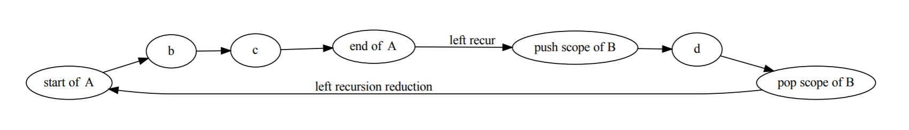

日记 2019-10-13 我和Python的故事(未完)

我和Python的故事
======================================

第0节
--------------------------------------------------------------------------------------------------

`Moshmosh <https://github.com/thautwarm/moshmosh/>`_ 的正式Release,  对我来说有一些意义.

它标志着我以前很重要的一个理想的彻底完成,  以及一个几乎贯穿我之前整个技术生涯的故事的平淡落幕.

我本科毕业已经过去了半年,  没有太多实感,  因为按照现实情况来看,  自从大一结束后我就不怎么上课,
所以总还是有一种什么时候会回到宿舍好好睡一觉的感觉.

在家里写码自觉不如学校宿舍里舒服,  不能坐个上一整天,  父母也会催我睡觉吃饭,  虽然明白他们是对我好,  但还是不由得怀念大一下开始
整日在宿舍里学习的节奏; 我是从大二开始的小学期正式开始学习Python的.

第1节: 科学计算, Python, 生物信息学和数据挖掘
--------------------------------------------------------------------------------------------------

第一次接触Python是从我高中最好的一位朋友那里,  当时在学C和MATLAB这些东西,  并且第一次接触Python
印象并不好. 我当时的想法好像是从notepad++里运行Python太过麻烦了,  还有当时不甚喜欢没法操作指针的语言,
于是学了一点就走开了.

真正开始学习Python的时间点是2016年9月的小学期.

那个时候我已经非常懂MATLAB,  除开科学计算我还用MATLAB写GUI和爬虫,  沉迷从源码里学机器学习算法,  且酷爱MATLAB的向量化写法.

在大一上结束的时候我被计算机老师推荐到计算机学院做生物信息学,  很快从教授那一届带的几个本科生(好像除了我都是大三科研训练的)里脱颖而出,
并且复现了几篇论文.

小学期里很闲,  学院院长教数学软件设计,  涉及到的是只是简单的Mathematica和MATLAB,  于是同时就开始看
Python的网课.

这个网课(中国大学MOOC的<<用Python玩转数据>>)的作者, 我至今都十分感激． 那是南京大学的张莉教授,  有点逗逼,  很好的一个老师.

我根据她的指示安装了anaconda,  初用Spyder-IDE时便觉得很舒服,  因为很像MATLAB,  所见即所得,  写码-报错-修改代码的反馈链非常快,
于是我越学越快,  很快超过了她的课程进度,  开始寻找其他的资源.

张莉老师的课,  除了语言本身就是一些标准库和Scientific Python工具链; 同时在实验室师兄的诱导下,  做了些长期项目(直到2017年11月才结束),
莫名其妙地对NumPy和Pandas熟悉到了相当的地步,  然后大概是在10月份开始后, 没事找数据挖掘比赛打.

打起来不算太费力,  因为很喜欢那种排名慢慢提升的感觉. 然后10月底的时候, CCF/Datafountain举办了一个规模比较大的比赛,  我参加了三个题目,
除开和学校某个师兄组队的那个题打得不好,  另外两个都取得了还不错的名次: 一个很可惜,  因为简单的TF-IDF算法没写对,
导致差点进复赛; 另一个参加人数很多,  接近千人,  我拿到了前10的成绩,  只差两名就能进决赛拿不少钱的样子.

在那之后感觉自己的Python还蛮厉害的,  虽然只学了两个月. 恰好大二上我提前修了离散和数值,  并且在后者的上机作业上,
不像其他学长学姐从27道题里选3道完成,  我用Python2完成了所有的题目,  并写出了长长的报告. 这最终如愿地拯救了我的成绩,
数值分析老师的欣赏弥补了我长期缺课落下的平时分．这里有一个很痛苦的回忆: 我的报告是用libreoffice写的.

同时, 这个时候我刚开始使用GitHub,  作业的大部分代码都还留在GitHub上
`The-Algorithms-in-Numerical-Analysis-with-Python-Implementation <https://github.com/thautwarm/The-Algorithms-in-Numerical-Analysis-with-Python-Implementation>`_ .

虽然有点丑,  但是还是不删了.

第2节: 转型的经过, 走向程序语言设计领域
--------------------------------------------------------------------------------------------------

大约在17年寒假期间,  又参与了一些机器学习的外包项目, 雇主不乏米国的一些知名大公司.

加上实验室师兄的引荐的长期科研项目, 每个月能拿到不少的报酬, 足以让父母不再操心学费以外的费用.

在寒假的机器学习外包中, 也认识了几个后来关系不错的朋友, 他们中一些人让我去玩flask,  以及一些ORM框架.

随后开始的是大二下学期, 我又去搞了一下Java网页开发的外包, 现在想来有点浪费时间,  就当增广见识.

三月份时, 主要在花时间和生物信息学那边的教授交流.

他还给了我一些给某篇nature文章找错的任务, 可惜我最后只完成了代码部分, 报告鸽掉了, 这一鸽就是两年半.

而我为什么鸽, 就是因为迷上了所谓的函数式编程, 程序语言技术和编译器. 而那份科研任务剩下的部分, 在一年半后被教授作为科研训练任务交给了别人.

在那个时间点, 因为长期的科研代码输出, 自觉在Python的了解程度上达到了某种界限, 迫切想要表达出一些自己的理解.

４月,  在一个叫泰迪杯的比赛期间,  某种神秘的感觉降临了我.

我觉得某种想要写一门语言的热情激荡在胸口, 于是我瞎捣鼓出了这个垃圾玩意儿: `SquirrelLanguage <https://github.com/thautwarm/SquirrelLanguage>`_ .

这个真的是块废物,  大概就像是v-lang一样,  过于幼稚的思考,  缺少专业知识和素养的滑稽形态, 和箭在弦上不得不发码在心头不能不敲的热血, 促使了这个语言的实现.

即便这种东西在现在的我看来一文不值,  但当时我的收获一定是货真价实的．我仍记得我花了三天三夜写出这个垃圾玩意儿的时候,
兴奋到无法入睡,  甚至在深夜研究了一下sublime text的高亮实现,  给这个语言造了一个高亮.

这背后也有很多其他有趣的故事.

例如, 那个时候我刚刚加入学校的动漫社, 在那个有归属感的地方, 我认识的一个外号叫"松鼠"的女孩子真的可爱爆棚.

所以, SquirrelLanguage的命名, 也有像名著开头"献给亲爱的xxx"一样献给松鼠姐姐的意思．

然而这个"语言"终究不是"名著",  只是一个无知者肮脏愚昧的尝试, 这样的玩意献给闺蜜, 自然是个友尽的结局, 所以后来松鼠姐姐和我的关系也日渐陌生, 沦为点赞之交.

啊, 上面这句话就是开个玩笑, 这个归因自然是无稽之谈.

实际上, 我后来因为学习太忙,  没有再和社团的朋友们经常玩, 和大家也都日渐陌生.

最后,  虽然当时很嗨地写了一门"语言",  但因为是比赛期间, 20多天的时间被我整的只有3天, 做得不理想, 没有拿奖.

自那以后我意识到我对打比赛是去了兴趣,  虽然总说"哎呀我们去Kaggle/天池玩玩", 但从2017年4月之后, 再也没有成真落实.

似乎是凭借当时的这个"语言", 我在知乎认识了雾雨魔理莎.

在这位的坑蒙拐骗下, 我带着一整套的机器学习和数据挖掘的知识和技能, 踏上了一条新的道路.

在那条道路上,  对于代码中广泛存在的相似, 我不再用似是而非的方式去认识.

第3节: 想要给Python添加高级语言特性的理想
------------------------------------------------------------------------------

从结果上来看, 雾雨魔理莎并没有教我任何具体的东西, 但是莎莎很清楚方向. 当时我们谈的东西似乎除开机器学习外就是Scala和Haskell的语言特性.

我当时初识"模式匹配", 就理解到这是一个极其essential的东西; 我意识到存在大量的抽象可以提升程序员的表达能力, 从而使得解决问题的观点
变得更高; 我同时爱上了Haskell中的where从句, 因为我认为这可以显著地降低阅读程序的难度.

此处我认为有必要稍微深入细节. 对于模式匹配, 因为它的意义过于广泛, 且生效于一定体积的codebase之中, 在这篇日记里无疑有点喧宾夺主;

但我几年间多次在不同的场合elaborate为什么where子句有用且意义深远, 其篇幅相对可以接受:

假设Python中存在where子句, 我们可以用下面的办法去求圆柱的表面积,

.. code-block:: Python

    # 圆柱面积 / surface area of a cylinder
    from math import pi
    r = 1  # the radius
    h = 10 # the height

    S = (2*S_top + S_side) where:
        S_top  = pi*r**2
        S_side = C * h where:
            C = 2*pi*r

这个例子来源于我的早期(2017年暑假)项目 flowpython_ .

.. _flowpython: https://github.com/thautwarm/flowpython/blob/master/flowpython/ReadMe.rst

这个程序的读法如下:

::

    从 math 库中导入 pi
    半径 = 1
    高 = 10
    表面积 = 2 * 底面积 + 侧面积, 其中
        底面积 = (pi * 半径)的平方
        测面积 = 周长 * 高, 其中
            周长 = 2 * pi * 半径

为什么where从句意义深远?

**第一点 , 对于具有相关专业知识的读者, 它可以大幅优化可读性.**

当我们看到表面积的定义时,

::

    # 表面积 = 2 * 底面积 + 侧面积
    S = 2*S_top + S_side

**如果我们的专业知识足以告诉我们表面积和侧面积的定义, 那么where从句里的内容, 我们是可以忽略的.**
仅凭这一点, 这已是相当有益的一种代码组织方式.

**第二点, 即便对于没有相关专业知识的人, 他在阅读代码时也会轻松很多, 因为他可以毫不费力地从where从句组织的代码结构里, 弄清某个概念的定义**.

当他不理解where从句的上一层逻辑时, 他可以放弃该层的阅读, 并进入从句内部, 先去理解相关定义.

**第三点, 减小程序员阅读代码时需要的记忆空间复杂度.**

作个假设, 你还不懂圆柱表面积怎么求, 今天你很累, 当理解一个新概念的定义时, **你不能接受它的定义里含有任何未知概念,**
那么你应该怎么去理解圆柱表面积公式?

答案就是使用where从句. Recall 表面积的定义,

::

    从 math 库中导入 pi
    半径 = 1
    高 = 10
    表面积 = 2 * 底面积 + 侧面积, 其中
        底面积 = (pi * 半径)的平方
        测面积 = 周长 * 高, 其中
            周长 = 2 * pi * 半径

并使用where从句引导的顺序去理解表面积的定义:

.. image:: ./static/where-elabo.png

可以发现, 理解新概念时不再有未知量.

你可能有一个问题, 为什么我们不按照上面的定义顺序依次定义各个概念,
而要用where从句?

两个方面.

首先(aka **第四点** ), **对于代码的书写者, where从句是展现了一种类似交互编程的机制, 减小了心智负担.**

代码的书写者有一个最终要完成的目的, 而在where从句的帮助下,
**他不需要记住实现最终目的会用到什么.** 因为完成目的需要的所有定义,
**都将随着代码的推进自然的展现出来.**

这种思想本身在算法中也有呈现, 例如在 `LL parser中支持左递归的算法 <https://github.com/thautwarm/RBNF.hs/blob/master/src/RBNF/LeftRecur.hs>`_ .

当存在顶层parser的概念时, 那么可以上述方式,
层层下降, 通过inline文法的方式, 消去一些产生式, 将所有的左递归转为直接左递归, 并将这些直接左递归提取出来,
做后续的代码生成.

例如对于文法

::

    A -> b c
    A -> B d
    B -> A e

按照where从句解构逻辑的思路, 我们处理得到下列的parsing graph,

其次(aka **第五点** ), **对于代码的阅读者, where从句的使用展现了主要目的.**

对比

::

    D, E, F, G, L, M, N, O 已知
    A = f_bc(B, C) where
        B = f_de(D, E)
        C = f_gh(F, G)
    H = f_ij(I, J) where
        I = f_lm(L, M)
        J = f_no(N, O)

和

::

    D, E, F, G, L, M, N, O 已知
    B = f_de(D, E)
    C = f_gh(F, G)
    A = f_bc(B, C)
    I = f_lm(L, M)
    J = f_no(N, O)
    H = f_ij(I, J)

前者使用where从句, 在语法上体现了不同符号的重要性; 而后者至多只能依靠不可靠的代码风格来区分重要度.

上面五点就是我总结的, where从句的意义.

而模式匹配比起where从句更为重要, 几乎可以说是现代化编程手段的基石.

在我了解了模式匹配, where从句以及其他对当时的我可谓全新的编程构造和思想之后, 新的狂热产生了.

对于Python的爱和对高级语言构造和思想的向往, 我产生了文首所说的那份理想, **为Python添加高级的语言构造** ;
同时, 文首所说的那个故事, 也就此开始.
